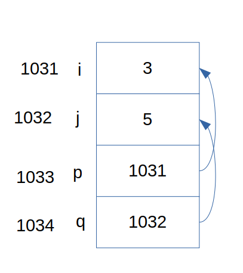
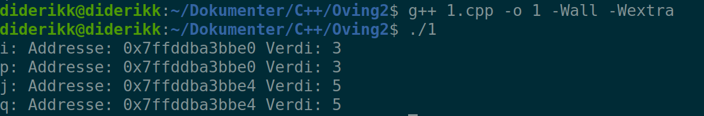
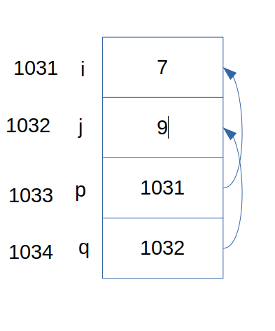
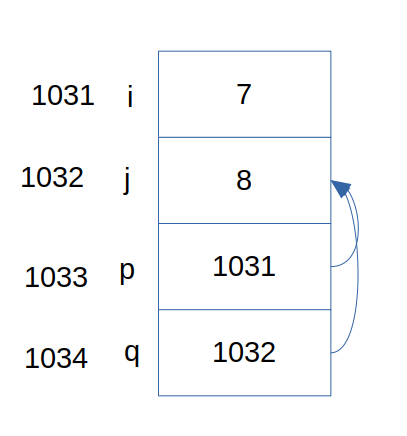
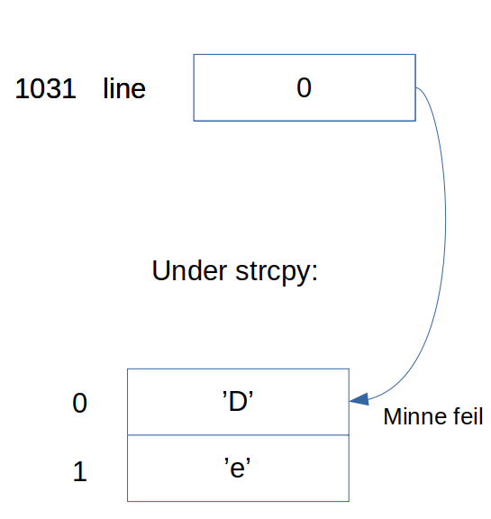

# Øving 2: Pekere og referanser

## Oppgave 1

### a
Tegning oppgave a:

Utskrift oppgave a:

Utskrift og tegning stemmer, siden peker p og q peker til sine variablers respektive addresser.

### b

Tegning etter *q += 4:

Tegning etter hele programbit:

Programmet skriver ut 8 8

## Oppgave 2

Vi får en minne segmenterings feil fordi vi bruker deler av minnet som ikke er allokert av programmet selv. Programmet bruker altså en del av maskinens minne som kan være i bruk av et annet program, eller som vi ikke har tilgang til. Årsaken er at line-pekeren begynner på addressen 0, men når programmet kopierer over teksten, endrer vi også på minne addressene 0-16. Denne delen av minne er ikke allokert av programmet og programmet skal derfor ikke endre på verdiene her, fører til segmenterings feil.

## Oppgave 3

* Brukeren kan skrive inn en tekst som er større enn 5 tegn, noe som er større en tabellen.
* Brukeren kan skrive en tekst som ikke inneholder "search_for"-tegnet som vil føre til en uendelig løkke. Dette vil føre til at vi endrer på skriver på minnet med høyere addresse en "text" tabellens addresse.
